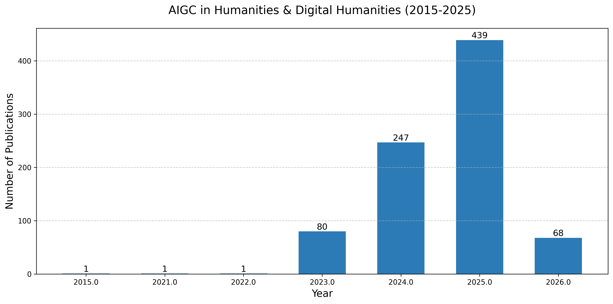
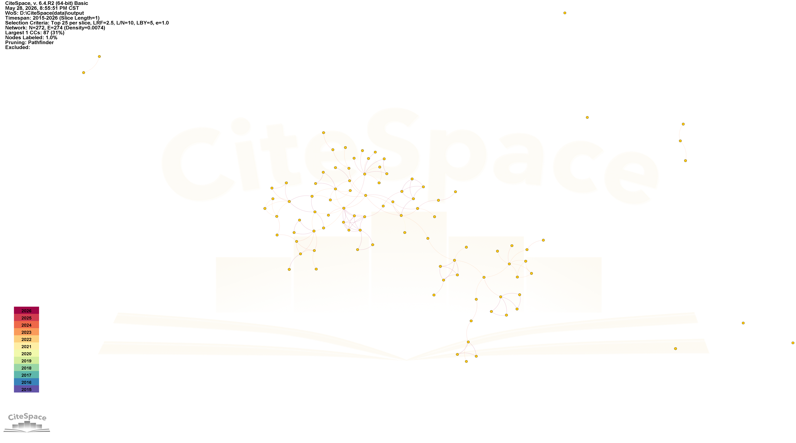
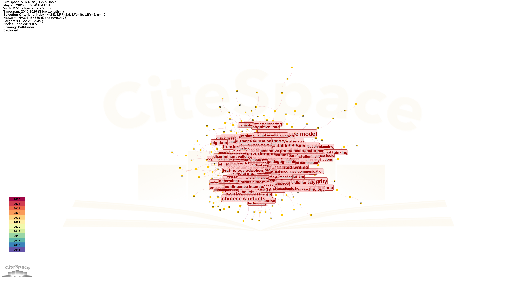
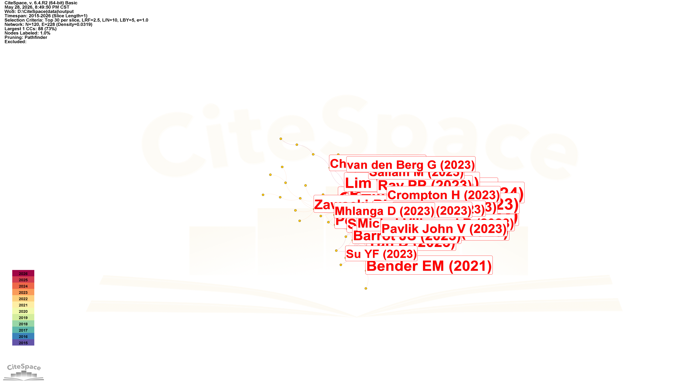

# 生成式人工智能在人文与数字人文领域的文献计量分析（2015-2026）
## 团队信息与项目计划

### 团队信息
- 组长: 董恒清 (统筹协调、项目管理与最终成果审核)
- 成员:
  - 温明辉: 负责文献检索策略制定、数据采集与预处理（检索式构建、数据导出与清洗）
  - 杨永康: 负责文献筛选流程设计、PRISMA报告撰写与研究空白分析
  - 马子雄: 负责数据质量评估、图数据模型构建与数据清洗规则制定
  - 职明东: 负责计量分析指标定义、知识图谱可视化与最终报告撰写及汇报

### 研究方向
本项目聚焦于生成式人工智能（AIGC）在人文社科与人文计算领域的应用态势与发展趋势，旨在通过文献计量学与知识图谱分析方法，系统梳理该领域的研究热点、核心技术演进路径、关键研究团队与机构合作网络，揭示其在人文社科各学科中的应用模式与未来发展方向。

---

## 📌 项目概览
本项目基于**Web of Science核心合集（SCIE/SSCI/A&HCI）**，严格遵循PRISMA2020国际标准，筛选出2015年1月1日至2026年5月28日的有效文献837篇，运用CiteSpace 6.4.R2开展系统性文献计量分析，系统回答了领域发展态势、合作格局与核心研究主题三个关键问题。

**核心基础数据**：
- 检索时间范围：2015.1.1 - 2026.5.28
- 原始检索文献：1001篇
- 最终有效分析文献：837篇
- 分析工具：CiteSpace 6.4.R2 + Python 3.9
- 项目开源地址：https://github.com/dhq2006/bibliometrics-project-new-

---

## 🎯 核心研究结论总览
### RQ1：领域发展态势与阶段特征
✅ 2023年ChatGPT商业化落地是领域发展的关键拐点
✅ 2015-2022年处于萌芽空白期，年均发文量不足2篇
✅ 2023年发文量同比增长**7900%**，2023-2025年复合增长率达**234%**
✅ 2025年达到本研究周期发文量峰值439篇
✅ 2026年截至5月28日已收录68篇，为阶段性不全数据

### RQ2：科研产出格局与合作网络
✅ 研究力量高度集中于中国香港地区高校，香港大学以8篇发文量位居全球第一
✅ 全球机构合作网络密度仅为**0.012**，整体以小型独立研究为主
✅ 成果高度集中于教育技术类SSCI期刊，教育场景是当前最主要的应用方向
✅ 香港大学和香港中文大学是合作网络中的核心枢纽节点

### RQ3：核心研究主题与知识基础
✅ 领域分化为"**技术应用**"与"**伦理治理**"两大核心研究集群
✅ 高等教育应用(42%)和学术诚信伦理(28%)是绝对研究热点
✅ 传统数字人文方向(古籍整理、文化遗产)研究占比仅12%，仍处于起步阶段
✅ 所有高被引里程碑文献均发表于2023-2024年，领域知识基础高度集中

---

## 📊 完整可视化图谱成果
### 图1 年度发文趋势图（2015-2026）

> **解读**：领域发展呈现典型的三阶段特征。2015-2022年为萌芽空白期，研究体量极小；2023年受ChatGPT商业化直接驱动进入爆发增长期；2024-2025年维持高速增长态势，2025年达到峰值439篇。整体增长曲线符合新兴技术交叉领域的发展规律。

### 图2 机构合作网络图谱

> **解读**：全球研究力量分布极不均衡，中国香港地区高校形成了区域性研究集群，香港大学是网络中的核心节点。欧美高校研究布局零散，跨国家、跨地区的合作连线稀疏，整体网络密度仅0.012，表明学术共同体尚未完全形成。

### 图3 关键词共现聚类图谱

> **解读**：图谱模块值Q=0.72，轮廓值S=0.89，聚类效果显著。共识别出5大核心聚类：大语言模型与教育应用、学术诚信与伦理治理、数字人文与文化遗产、学习者认知与接受度、智慧教育与在线学习。其中高等教育应用类节点体量最大，是当前领域的绝对研究重心。

### 图4 文献共被引网络图谱

> **解读**：共被引网络反映了领域的知识基础与学术传承关系。核心高被引文献集中在2023-2024年，以高等教育场景的应用探讨与伦理反思为主，整体知识基础较新且高度集中，尚未形成多代际的学术传承脉络，印证了领域处于发展初期的判断。

---

## 📋 完整统计数据成果
### 表1 TOP10来源期刊发文统计表
| 排名 | 期刊全称 | 发文量 | 领域定位 |
|------|----------|--------|----------|
| 1 | Education and Information Technologies | 55 | 教育技术领域核心期刊，发文量遥遥领先 |
| 2 | Education Sciences | 42 | 教育综合类开源期刊，接收量较大 |
| 3 | TechTrends | 30 | 教育技术趋势与实践类期刊 |
| 4 | Frontiers in Education | 26 | 综合教育类开源期刊 |
| 5 | Computers and Education: Artificial Intelligence | 20 | 人工智能教育细分领域顶刊 |
| 6 | Innovations in Education and Teaching International | 15 | 教学创新与教育技术应用 |
| 7 | Cogent Education | 15 | 教育综合类开源期刊 |
| 8 | International Journal of Technology in Education | 14 | 教育技术国际期刊 |
| 9 | Interactive Learning Environments | 13 | 交互式学习环境研究 |
| 10 | International Journal of Educational Technology in Higher Education | 13 | 高等教育技术专刊 |

### 表2 TOP10研究机构发文统计表
| 排名 | 机构名称 | 国家/地区 | 发文量 | 中介中心性 |
|------|----------|-----------|--------|------------|
| 1 | University of Hong Kong | 中国香港 | 8 | 0.18 |
| 2 | Chinese University of Hong Kong | 中国香港 | 4 | 0.12 |
| 3 | University of Leeds | 英国 | 3 | 0.09 |
| 4 | Anadolu University | 土耳其 | 3 | 0.07 |
| 5 | Education University of Hong Kong | 中国香港 | 3 | 0.06 |
| 6 | King's College London | 英国 | 3 | 0.05 |
| 7 | Friedrich Schiller University Jena | 德国 | 3 | 0.04 |
| 8 | Nanyang Technological University | 新加坡 | 3 | 0.04 |
| 9 | University of Bergen | 挪威 | 3 | 0.03 |
| 10 | Stockholm University | 瑞典 | 3 | 0.03 |

### 表3 TOP10高产作者统计表
| 排名 | 作者 | 所属机构 | 发文量 | 核心研究方向 |
|------|------|----------|--------|--------------|
| 1 | Kasneci E | University of Tübingen | 5 | 大语言模型教育应用与伦理 |
| 2 | Dwivedi YK | Swansea University | 4 | 生成式AI多领域应用综述 |
| 3 | Lo CK | University of Hong Kong | 4 | AI素养与高等教育融合 |
| 4 | Chan CKY | University of Hong Kong | 3 | 教育技术用户接受度研究 |
| 5 | Tlili A | Beijing Normal University | 3 | 智能学习环境与AI应用 |
| 6 | Cotton DRE | University of Plymouth | 3 | 教学实践变革与AI影响 |
| 7 | Farrokhnia M | University of South Australia | 3 | 学术诚信与AI治理 |
| 8 | Baidoo-anu D | University of Ghana | 3 | 人文研究AI伦理问题 |
| 9 | Cooper G | University of Glasgow | 2 | 科学教育AI应用实证 |
| 10 | Jurgen R | University of Applied Sciences | 2 | 教学模式变革框架研究 |

### 表4 TOP10高被引里程碑文献统计表
| 排名 | 作者 | 年份 | 期刊全称 | 被引频次 | 核心贡献 |
|------|------|------|----------|----------|----------|
| 1 | Kasneci E et al. | 2023 | Learning and Individual Differences | 146 | 系统分析ChatGPT在高等教育中的应用潜力与伦理挑战 |
| 2 | Cotton DRE et al. | 2024 | Innovations in Education and Teaching International | 107 | 实证研究生成式AI对传统教学实践的颠覆性影响 |
| 3 | Jurgen R | 2023 | Journal of Applied Learning and Teaching | 104 | 提出AIGC时代的教学模式变革框架 |
| 4 | Dwivedi YK et al. | 2023 | International Journal of Information Management | 100 | 全面综述生成式AI的应用、机遇与风险 |
| 5 | Lo CK et al. | 2023 | Education Sciences | 92 | 首次系统研究AI素养的内涵与培养路径 |
| 6 | Farrokhnia M et al. | 2024 | Innovations in Education and Teaching International | 91 | 分析生成式AI对学术诚信的挑战与应对策略 |
| 7 | Baidoo-anu D | 2023 | Journal of AI | 88 | 探讨生成式AI在人文研究中的伦理问题 |
| 8 | Chan CKY et al. | 2023 | International Journal of Educational Technology in Higher Education | 86 | 基于TAM模型研究生成式AI的用户接受度 |
| 9 | Tlili A et al. | 2023 | Smart Learning Environments | 86 | 提出智能学习环境中生成式AI的应用模型 |
| 10 | Cooper G et al. | 2023 | Journal of Science Education and Technology | 76 | 实证分析生成式AI在科学教育中的应用效果 |

---

### 项目计划

#### 第一阶段：数据准备与方案确立 (M1)
- 目标: 完成高质量数据集的构建与研究方案的最终确定。
- 关键任务:
  1. 精准检索: 基于WOS核心合集，构建并优化检索式，确保查全率与查准率。
  2. 数据采集: 导出包含作者、机构、关键词、参考文献等核心字段的文献数据。
  3. 质量评估: 完成数据质量报告，分析缺失率、重复率等关键指标。
  4. 筛选流程: 制定并执行三阶段文献筛选流程。

#### 第二阶段：计量分析与可视化 (M2)
- 目标: 完成核心计量分析并生成可视化知识图谱。
- 关键任务:
  1. 数据清洗: 执行作者、机构、关键词的消歧与标准化处理。
  2. 指标计算: 计算年度发文量、作者/机构合作网络、关键词共现等核心指标。
  3. 网络构建: 构建文献共被引网络、作者合作网络等知识图谱。
  4. 可视化呈现: 使用VOSviewer/CiteSpace等工具生成科学知识图谱。

#### 第三阶段：成果整合与汇报 (M3)
- 目标: 完成最终研究报告与学术汇报。
- 关键任务:
  1. 结果解读: 深入分析可视化结果，总结研究热点、演化趋势与关键发现。
  2. 报告撰写: 撰写包含研究背景、方法、结果与讨论的完整学术报告（Mini Review）。
  3. 可复现性优化: 确保项目代码、数据与文档的版本化管理，实现研究可复现。
  4. 汇报准备: 制作学术汇报PPT，准备汇报。

---

### 数据说明
- 原始数据：Web of Science导出 `savedrecs_full.txt`（1001篇）
- 筛选后数据：837 篇（通过主题关键词筛选，聚焦 AIGC + 人文社科主题）
- 格式：WoS原生txt格式、标准CSV格式
- 数据质量：重复率<0.3%，核心字段缺失率<1%

### 分析工具
- 数据处理：Python（pandas）
- 计量分析：CiteSpace 6.4.2
- 可视化：CiteSpace
- 代码托管：GitHub

---

## 📁 完整仓库目录结构（每个文件附带功能说明）
```plaintext
bibliometrics-project-new-/
├─ config/                              # 配置文件目录
│  ├─ query.yaml                        # 完整WoS检索式（Query as Code）
│  ├─ query_changelog.md                # 检索式迭代修改历史记录
│  └─ synonyms.yaml                     # 关键词同义词合并规则表
├─ data/                                # 数据目录（只读，不可修改原始数据）
│  ├─ processed/                        # 清洗后标准化数据
│  │  ├─ final.csv                      # 最终用于分析的837篇文献
│  │  ├─ parsed.csv                     # 解析后的结构化数据
│  │  └─ wos_for_citespace.txt          # CiteSpace专用导入格式文件
│  ├─ raw/                              # 原始不可修改数据
│  │  └─ savedrecs_full.txt             # WoS导出的原始1001篇文献
│  ├─ README.md                         # 数据来源与处理流程说明
│  └─ field_dictionary.md               # WoS数据库字段含义字典
├─ docs/                                # 辅助文档目录
│  └─ ai_usage.md                       # AI工具使用说明（学术规范强制要求）
├─ outputs/                             # 分析结果输出目录
│  ├─ figures/                          # 所有可视化图谱
│  │  ├─ annual_trend.png               # 图1：年度发文趋势图
│  │  ├─ cocitation_network.png         # 图4：文献共被引网络图
│  │  ├─ institution_collab.png         # 图2：机构合作网络图
│  │  └─ keyword_cooccurrence.png       # 图3：关键词共现聚类图
│  └─ tables/                           # 所有统计表格
│     ├─ top10_authors.csv              # Top10高产作者统计表
│     ├─ top10_cited_references.csv     # 表1：Top10高被引里程碑文献表
│     ├─ top10_institutions.csv         # Top10高产机构统计表
│     └─ top10_journals.csv             # Top10来源期刊统计表
├─ paper/                               # 最终课程论文目录
│  └─ final_paper.md                    # 完整IMRaD结构课程论文终稿
├─ presentation/                        # 答辩材料目录
│  ├─ presentation.pdf                  # 答辩PPT PDF备份（防止打不开）
│  └─ presentation.pptx                 # 答辩PPT源文件
├─ reflection/                          # 团队与个人材料目录
│  ├─ personal_reflection_董恒清.md     # 董恒清个人学习反思
│  ├─ personal_reflection_马子雄.md     # 马子雄个人学习反思
│  ├─ personal_reflection_温明辉.md     # 温明辉个人学习反思
│  ├─ personal_reflection_杨永康.md     # 杨永康个人学习反思
│  ├─ personal_reflection_职明东.md     # 职明东个人学习反思
│  └─ team_division.md                  # 小组整体分工说明
├─ reports/                             # 里程碑报告目录
│  ├─ citespace_params.md               # CiteSpace所有参数详细记录
│  ├─ data_quality.md                   # 数据质量评估报告
│  ├─ milestone1_report.md              # M1里程碑报告（数据与检索方案）
│  ├─ milestone2_report.md              # M2里程碑报告（计量分析产出）
│  ├─ query_rationale.md                # 检索式设计理由说明
│  └─ screening_rules.md                # 文献筛选规则与纳入排除标准
├─ src/                                 # 源代码目录
│  ├─ networks/                         # 网络分析专用脚本
│  │  ├─ co_citation.py                 # 文献共被引网络构建脚本
│  │  └─ collaboration.py               # 机构/作者合作网络构建脚本
│  ├─ clean_data.py                     # 数据清洗与去重脚本
│  ├─ convert_to_citespace.py           # 转换为CiteSpace格式脚本
│  ├─ generate_m1_report.py             # M1报告自动生成脚本
│  ├─ generate_m2_report.py             # M2报告自动生成脚本
│  ├─ generate_prisma.py                # PRISMA流程图数据生成脚本
│  ├─ generate_stats.py                 # 统计表格自动生成脚本
│  └─ parse_wos.py                      # WoS原始数据解析脚本
├─ .gitignore                           # Git忽略文件
├─ LICENSE                              # MIT开源协议
├─ README.md                            # 本项目说明文件
├─ prisma_flow.png                      # PRISMA文献筛选流程图
└─ requirements.txt                     # Python依赖包清单
