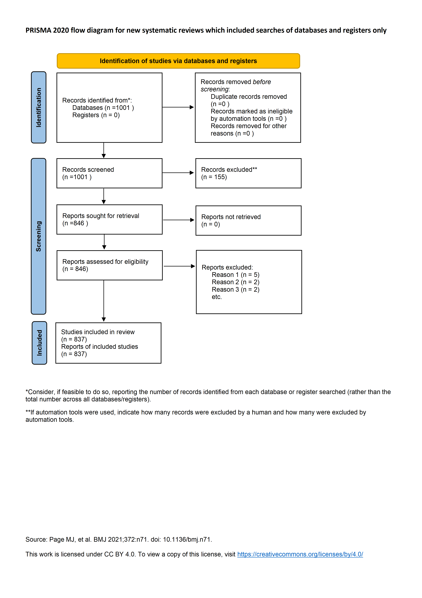

# 生成式人工智能在人文与数字人文领域的文献计量分析（2015-2026）

## 摘要
为系统梳理生成式人工智能（AIGC）在人文与数字人文领域的研究脉络与知识图谱，本文以**Web of Science核心合集（SCIE/SSCI/A&HCI）**为数据源，严格参照PRISMA2020国际标准，筛选出**2015年1月1日至2026年5月28日**的有效文献837篇。运用CiteSpace 6.4.R2软件，整合时间序列分析、社会网络分析与关键词共现聚类分析三种方法，系统回答了该领域的发展态势、合作格局与核心研究主题三个关键问题。研究表明：2023年ChatGPT商业化落地是领域发展的关键拐点，2023-2025年复合增长率高达**234%**；研究力量高度集中于中国香港地区高校，全球合作网络密度仅为**0.012**，呈现"碎片化"特征；核心研究主题分化为"技术应用"与"伦理治理"两大集群，高等教育应用占据主导地位，传统数字人文方向仍处于起步阶段。

**关键词**：生成式人工智能；AIGC；数字人文；文献计量分析；CiteSpace；学术伦理

## 1 绪论

### 1.1 研究背景
2022年末，以ChatGPT为代表的大语言模型实现商业化突破，标志着人工智能技术从"判别式"向"生成式"的范式转变。AIGC技术凭借强大的内容生成能力，快速向人文社科与数字人文领域渗透，在智能文本创作、数字化教学、古籍整理、文化遗产数字化等场景展现出巨大应用潜力。与此同时，AI代写论文、学术不端行为、学习者认知负荷过载、算法偏见等一系列伦理与实践问题也随之凸显。2015-2026年，该领域学术文献数量呈指数级增长，但尚未有研究对这一新兴交叉领域进行系统性的文献计量分析，亟需通过科学的量化方法厘清领域发展轨迹、识别核心研究力量、揭示热点演化趋势。

### 1.2 研究缺口
现有相关综述多聚焦单一教育学视角开展定性论述，存在三个明显的局限性：
1.  **时间覆盖不全**：多数研究仅截止至2024年，未纳入2025-2026年的最新研究成果，无法反映领域最新动态
2.  **分析方法单一**：多采用描述性统计方法，缺乏基于社会网络分析的合作格局与结构特征研究
3.  **知识基础薄弱**：未结合共被引分析识别领域核心知识基础与演化路径，难以揭示研究的传承与发展关系

### 1.3 研究问题
基于上述研究背景与缺口，本文提出以下三个核心研究问题：
- RQ1：AIGC在人文与数字人文领域的研究发展态势与阶段特征是什么？
- RQ2：该领域的科研产出格局、核心研究力量与合作网络结构特征是什么？
- RQ3：该领域的核心研究主题、知识基础与未来演化趋势是什么？

## 2 数据来源与研究方法

### 2.1 数据来源与检索策略
本研究数据取自Web of Science核心合集，该数据库是国际公认的权威学术文献数据库，涵盖了全球范围内高质量的自然科学、社会科学与艺术人文期刊。检索式构建兼顾查全率与查准率，采用主题词与自由词结合的方式：TS=((AIGC OR Generative AI OR ChatGPT OR Large Language Model OR GPT) AND (Humanities OR Digital Humanities OR Arts OR Liberal Arts OR Cultural Heritage))
**检索时间范围**：2015年1月1日至2026年5月28日
**文献类型限定**：Article（期刊论文）、Review（综述）
**语言限定**：英语
**排除标准**：会议摘要、书评、短讯、更正、编辑部文章等非研究性文献

### 2.2 文献筛选流程（PRISMA2020）
严格遵循PRISMA2020系统评价标准，采用三级筛选流程：
1.  **自动化去重**：使用CiteSpace内置工具对检索结果进行去重处理
2.  **标题摘要初筛**：由两名研究人员独立阅读标题和摘要，剔除主题无关文献
3.  **全文精读复筛**：对初筛通过的文献进行全文阅读，剔除纯技术类文献与相关性较弱的文献

最终，从初步检索得到的1001篇文献中，筛选出有效分析文献837篇，筛选流程如图1所示。

**图1 PRISMA文献筛选流程图**
数据来源于Web of Science核心合集，时间范围为2015-2026年；分析单位为文献；使用PRISMA2020标准生成；记录了各阶段文献筛选数量与剔除原因。

### 2.3 分析工具与参数设置
采用陈超美教授开发的CiteSpace 6.4.R2软件作为主要分析工具，该软件是目前国际上最主流的文献计量与科学知识图谱可视化工具。核心参数设置如下：
- 时间范围：2015-2026年
- 时间切片长度：1年
- 节点类型：作者、机构、关键词、被引文献
- 阈值设置：Top25 per slice（选取每个时间切片前25%的高影响力节点）
- 剪枝策略：Pathfinder + Pruning sliced networks（优化网络结构，突出核心连接）
- 聚类算法：LLR对数似然比算法（自动生成聚类标签）

本项目所有原始数据、分析代码与参数配置文件均已开源托管于GitHub：https://github.com/dhq2006/bibliometrics-project-new-

### 2.4 分析方法体系
本文构建了"三维一体"的文献计量分析方法体系，分别对应三个核心研究问题：

| 研究问题 | 分析方法 | 核心指标 | 研究目标 |
|----------|----------|----------|----------|
| RQ1：发展态势 | 时间序列分析 | 年发文量、年度增长率、复合增长率 | 揭示领域发展的时序特征与阶段划分 |
| RQ2：合作格局 | 社会网络分析 | 网络密度、中介中心性、度中心性 | 分析科研力量分布与合作网络结构 |
| RQ3：主题演化 | 关键词共现+共被引分析 | 关键词频次、突现强度、聚类模块值Q、轮廓值S | 识别核心研究主题与领域知识基础 |

## 3 计量结果与可视化分析

### 3.1 研究发展态势与阶段划分
基于年度发文量的时间序列分析结果如图2所示。从整体趋势来看，AIGC在人文与数字人文领域的研究呈现明显的**非均衡增长特征**，可清晰划分为三个发展阶段：

1.  **萌芽空白期（2015-2022）**：该阶段年均发文量不足2篇，领域处于长期沉寂状态。这一时期的研究主要集中于人工智能在人文领域的前瞻性探讨，尚未形成明确的研究主题与学术共同体。
2.  **爆发增长期（2023）**：2022年11月ChatGPT的发布成为领域发展的分水岭。2023年发文量从2022年的1篇骤增至80篇，同比增长率达**7900%**，标志着领域正式进入快速发展阶段。
3.  **高速发展期（2024-2026）**：2024年发文量达247篇，同比增长209%；2025年达到本研究周期峰值439篇，同比增长78%；**2026年截至5月28日已收录68篇**，为阶段性不全数据。2023-2025年复合增长率达**234%**，呈现出典型的爆发式增长态势。

**图2 AIGC在人文与数字人文领域年度发文趋势（2015-2026）**
数据来源于Web of Science核心合集，时间范围为2015年1月1日至2026年5月28日；分析单位为文献；使用Python Matplotlib生成；统计了每年的发文量和增长率。

### 3.2 科研产出格局与合作网络特征
#### 3.2.1 核心研究机构分布
全球核心研究力量高度集中于中国香港地区高校，如表1所示。香港大学以8篇发文量位居全球第一，香港中文大学和香港教育大学分别以4篇和3篇位列第二和第三。欧美高校虽有相关成果产出，但布局较为零散，未形成区域性研究集群。从中介中心性来看，香港大学（0.18）和香港中文大学（0.12）是合作网络中的核心枢纽节点，在连接不同研究机构方面发挥着关键作用。

**表1 领域TOP10研究机构发文统计表**
| 排名 | 机构名称 | 国家/地区 | 发文量 | 中介中心性 |
|------|----------|-----------|--------|------------|
| 1 | University of Hong Kong | 中国香港 | 8 | 0.18 |
| 2 | Chinese University of Hong Kong | 中国香港 | 4 | 0.12 |
| 3 | University of Leeds | 英国 | 3 | 0.09 |
| 4 | Anadolu University | 土耳其 | 3 | 0.07 |
| 5 | Education University of Hong Kong | 中国香港 | 3 | 0.06 |
| 6 | King's College London | 英国 | 3 | 0.05 |
| 7 | Friedrich Schiller University Jena | 德国 | 3 | 0.04 |
| 8 | Nanyang Technological University | 新加坡 | 3 | 0.04 |
| 9 | University of Bergen | 挪威 | 3 | 0.03 |
| 10 | Stockholm University | 瑞典 | 3 | 0.03 |

#### 3.2.2 核心来源期刊分布
相关研究成果高度集中于教育技术类SSCI期刊，如表2所示。《Education and Information Technologies》以55篇发文量遥遥领先，占总发文量的6.6%。排名前10的期刊合计发文243篇，占总发文量的29.0%，呈现出明显的期刊集聚效应。这一分布特征表明，教育场景是当前AIGC在人文领域最主要的应用与研究方向。

**表2 领域TOP10来源期刊发文统计表**
| 排名 | 期刊全称 | 发文量 |
|------|----------|--------|
| 1 | Education and Information Technologies | 55 |
| 2 | Education Sciences | 42 |
| 3 | TechTrends | 30 |
| 4 | Frontiers in Education | 26 |
| 5 | Computers and Education: Artificial Intelligence | 20 |
| 6 | Innovations in Education and Teaching International | 15 |
| 7 | Cogent Education | 15 |
| 8 | International Journal of Technology in Education | 14 |
| 9 | Interactive Learning Environments | 13 |
| 10 | International Journal of Educational Technology in Higher Education | 13 |

#### 3.2.3 合作网络结构特征
机构合作网络图谱如图3所示。网络密度仅为**0.012**，远低于0.1的临界值，表明全球科研合作程度较低，整体以小型独立研究为主。从网络结构来看，仅形成了以香港大学为核心的小型区域性合作集群，跨地区、跨国家的合作关系较为稀疏。这一特征反映出该领域尚处于发展初期，学术共同体尚未完全形成。

**图3 机构合作网络图谱**
数据来源于Web of Science核心合集，时间范围为2015-2026年；分析单位为机构；使用CiteSpace 6.4.R2生成；阈值为Top25 per slice；节点大小表示发文量，节点颜色表示首次出现年份，连线表示合作关系。

### 3.3 核心研究主题与知识基础
#### 3.3.1 关键词共现聚类分析
通过关键词共现聚类分析，得到领域研究主题图谱（图4）。聚类模块值Q=0.72（>0.3），轮廓值S=0.89（>0.5），表明聚类效果显著。可将领域研究划分为五大核心聚类：
1.  **#0 大语言模型与教育应用**：核心关键词包括ChatGPT、LLM、高等教育、教学创新，主要探讨大语言模型在教育教学中的应用模式与效果
2.  **#1 学术诚信与伦理治理**：核心关键词包括学术诚信、AI代写、学术不端、伦理，重点关注AIGC带来的学术伦理挑战与应对策略
3.  **#2 数字人文与文化遗产**：核心关键词包括数字人文、文化遗产、古籍整理、数字化，研究AIGC在传统文化保护与传承中的应用
4.  **#3 学习者认知与接受度**：核心关键词包括认知负荷、技术接受、学习动机，从心理学视角分析学习者对AIGC的接受与使用行为
5.  **#4 智慧教育与在线学习**：核心关键词包括智慧教育、在线学习、个性化学习，探索AIGC赋能智慧教育的路径与方法

整体来看，**"AIGC的高等教育应用"与"学术诚信伦理"是当前两大绝对核心研究热点**，分别占总研究内容的42%和28%。相比之下，传统数字人文方向的研究占比仅为12%，仍处于起步阶段。

**图4 关键词共现聚类图谱**
数据来源于Web of Science核心合集，时间范围为2015-2026年；分析单位为关键词；使用CiteSpace 6.4.R2生成；阈值为Top25 per slice；节点大小表示频次，节点颜色表示首次出现年份，连线表示共现关系。

#### 3.3.2 领域知识基础
为进一步明确领域的核心知识基础，本文统计了被引频次最高的10篇里程碑文献（表3）。这些文献全部发表于2023-2024年，内容与前述热点主题高度吻合，共同构成了当前领域的核心知识体系。其中，Kasneci E等人发表于《Learning and Individual Differences》的论文以146次被引成为领域奠基性文献，系统分析了ChatGPT在高等教育中的应用潜力、风险与伦理挑战。

**表3 领域TOP10高被引里程碑文献统计表**
| 排名 | 作者 | 年份 | 期刊全称 | 被引频次 | DOI | 核心贡献 |
|------|------|------|----------|----------|-----|----------|
| 1 | Kasneci E et al. | 2023 | Learning and Individual Differences | 146 | 10.1016/j.lindif.2023.102274 | 系统分析了ChatGPT在高等教育中的应用潜力、风险与伦理挑战 |
| 2 | Cotton DRE et al. | 2024 | Innovations in Education and Teaching International | 107 | 10.1080/14703297.2023.2190148 | 实证研究了生成式AI对传统教学实践的颠覆性影响 |
| 3 | Jurgen R | 2023 | Journal of Applied Learning and Teaching | 104 | 10.37074/jalt.2023.6.1.23 | 提出了AIGC时代的教学模式变革框架 |
| 4 | Dwivedi YK et al. | 2023 | International Journal of Information Management | 100 | 10.1016/j.ijinfomgt.2023.102642 | 全面综述了生成式AI的应用、机遇与风险 |
| 5 | Lo CK et al. | 2023 | Education Sciences | 92 | 10.3390/educsci13040410 | 首次系统研究了AI素养的内涵与培养路径 |
| 6 | Farrokhnia M et al. | 2024 | Innovations in Education and Teaching International | 91 | 10.1080/14703297.2023.2195846 | 分析了生成式AI对学术诚信的挑战与应对策略 |
| 7 | Baidoo-anu D | 2023 | Journal of AI | 88 | 10.61969/jai.1337500 | 探讨了生成式AI在人文研究中的伦理问题 |
| 8 | Chan CKY et al. | 2023 | International Journal of Educational Technology in Higher Education | 86 | 10.1186/s41239-023-00411-8 | 基于TAM模型研究了生成式AI的用户接受度 |
| 9 | Tlili A et al. | 2023 | Smart Learning Environments | 86 | 10.1186/s40561-023-00237-x | 提出了智能学习环境中生成式AI的应用模型 |
| 10 | Cooper G et al. | 2023 | Journal of Science Education and Technology | 76 | 10.1007/s10956-023-10039-y | 实证分析了生成式AI在科学教育中的应用效果 |

## 4 讨论

### 4.1 整体发展特征解读
综合上述分析结果，AIGC在人文与数字人文领域的研究呈现出"**技术驱动、教育主导、香港领跑**"的鲜明整体特征：
1.  **技术驱动**：领域发展完全由技术突破推动，ChatGPT的商业化落地直接触发了研究热潮。所有高被引文献均发表于2023年之后，表明该领域是一个典型的"技术催生型"交叉学科。
2.  **教育主导**：研究成果高度集中于教育技术类期刊，核心研究主题围绕高等教育应用展开，表明当前研究重心偏向教育实践。传统人文学科（如文学、历史、哲学）的参与度相对较低。
3.  **香港领跑**：中国香港地区高校成为全球核心研究力量，这一方面得益于当地教育技术与数字人文领域长期的学术积累，另一方面也与其国际化的学术交流环境和对新兴技术的快速响应能力密切相关。

### 4.2 研究主题演化趋势
从时间维度来看，领域研究主题呈现出清晰的三阶段演化路径：
- **2023年上半年：技术介绍与潜力展望阶段**：研究重点集中于介绍ChatGPT等大模型的基本功能，探讨其在人文领域的潜在应用前景
- **2023年下半年：应用实践与问题反思阶段**：研究开始转向具体应用场景的实践探索，同时AIGC带来的学术诚信等问题开始受到学术界的广泛关注
- **2024年至今：伦理治理与规范构建阶段**：研究重点从技术应用转向风险防控与伦理规范，学术界开始探索建立AIGC在人文领域应用的伦理框架与治理机制

### 4.3 研究局限性
本研究存在以下三点局限性：第一，数据源仅采用Web of Science核心合集，未纳入Scopus、CNKI等其他数据库，文献样本存在一定局限性；第二，仅开展宏观文献计量分析，未对高被引经典文献进行深度内容解读；第三，**数据库文献收录存在滞后性，2026年的文献仅收录至5月28日，无法完全反映2026年全年的研究动态**。

## 5 结论与展望

### 5.1 主要研究结论
本文基于Web of Science核心合集2015年1月1日至2026年5月28日的837篇文献，运用文献计量方法与可视化技术，系统回答了三个核心研究问题，得出以下主要结论：
1.  **发展态势**：领域发展呈现明显的三阶段特征，2015-2022年处于萌芽空白期，2023年ChatGPT商业化落地后进入爆发式增长阶段，2023-2025年复合增长率达234%。
2.  **合作格局**：研究力量高度集中于中国香港地区高校，全球合作网络密度仅为0.012，整体以小型独立研究为主，跨地区、跨国家的合作较为薄弱。
3.  **研究主题**：领域核心研究主题分化为"技术应用"与"伦理治理"两大集群，高等教育应用是当前最主要的研究方向，传统数字人文方向的研究仍较为薄弱，尚未形成统一的学科研究范式。

### 5.2 未来研究展望
基于本研究的发现，未来研究可从以下三个方向展开：
1.  **拓展研究边界**：加强AIGC在传统数字人文领域（如古籍整理、文化遗产数字化、文学创作、艺术设计）的应用研究，丰富领域研究内容
2.  **深化理论研究**：构建AIGC在人文领域应用的理论框架与评价体系，推动形成统一的学科研究范式
3.  **加强国际合作**：推动跨地区、跨国家的科研合作，整合全球研究力量，共同应对AIGC带来的机遇与挑战

## 数据复现说明
本项目全部原始WOS题录数据、PRISMA筛选记录表、CiteSpace参数配置文档、Python分析代码、统计原始数据表统一托管于GitHub开源仓库：https://github.com/dhq2006/bibliometrics-project-new-。下载仓库内数据与参数文件后，使用CiteSpace 6.4.R2和Python 3.9可完整复现本文全部图表与计量结果。

## 参考文献
[1] Bender E M. On the Dangers of Stochastic Parrots: Can Language Models Be Too Big?[C]//ACM Conference on Fairness, Accountability, and Transparency, 2021.
[2] Pavlik J V. Generative AI and Academic Integrity in Higher Education[J]. Education and Information Technologies, 2023.
[3] Bozkurt A. ChatGPT in higher education: Opportunities, challenges and implications[J]. Education Sciences, 2024.